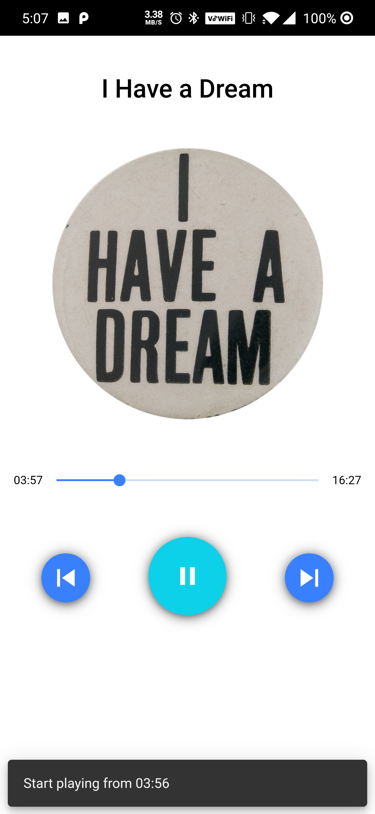

# Vajra dance player
This apk use example created by [Michael Xieyang Liu](https://lxieyang.github.io)
Created from Ionic Audio Player (updated w/ Ionic v4 & Angular v8 in 2019)

This is a simple audio player created with **Ionic 4+** / **Angular 8+** (updated in 2019)

To try it out, use the following commands to install the app on an actual device:

- For Android devices: make sure you have a wired connection from your phone to your Mac/PC, then run `ionic cordova run android --prod` in terminal.

## Ionic Native Plugins

- [File](https://ionicframework.com/docs/native/file/)
- [File Transfer](https://ionicframework.com/docs/native/file-transfer/)
- [Media](https://ionicframework.com/docs/native/media/)

## Support Platforms

- Android

## UI Preview

### Android

### GIF

## References

Thanks to the following posts and sources, I was able to come up with this solution:

- [Help: Using Cordova Media to create progress bar with ion-range](https://forum.ionicframework.com/t/using-cordova-media-to-create-progress-bar-with-ion-range/92368)
- [Ionic Component: Range](http://ionicframework.com/docs/api/components/range/Range/)
- [MediaManager isn't getting the correct duration #42](https://github.com/arielfaur/ionic-audio/issues/42)
- [Cordova Media Capture - Find duration of audio file](https://stackoverflow.com/questions/38266702/cordova-media-capture-find-duration-of-audio-file)

